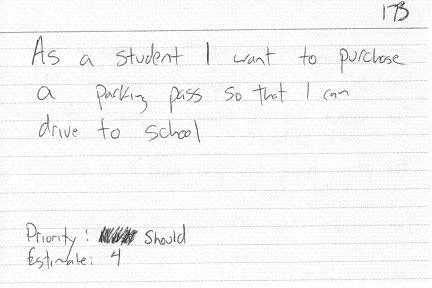

class: middle left

# <b>pidgin language:</b> a grammatically simplified means of communication that develops between two or more groups that lack a common language

---

# Why do pidgin languages develop?

.large[
- prolonged, regular contact between the different language communities

- a need to communicate between them

- an absence of a widespread, accessible interlanguage
]

.footnote[

*SOURCE: https://en.wikipedia.org/wiki/Pidgin#Development*
]
---

class: middle center inverse

#### `typeof(user_story) == "pidgin language"`

---

## User Stories are requirements in plain language.

 
 
 
 
 
 

### A .bold[[user]] can .bold[[action]] on .bold[[object]] .bold[[for (optional) reason]].

---

## Consider a use-case in forecasting...

- An analyst can upload data to generate their own time-series forecast.

- An analyst can select the number of days to forecast.

- An analyst can generate a time series forecast.

- An analyst can view a plot summarizing the forecasted data.

- An analyst can download the generated forecast for external analysis.

- An administrator can view previously processed time series forecasts.

---
## .bold[[user]] - Who is interacting with the system?

- An .highlight[analyst] can upload data to generate their own time-series forecast.

- An .highlight[analyst] can select the number of days to forecast.

- An .highlight[analyst] can generate a time series forecast.

- An .highlight[analyst] can view a plot summarizing the forecasted data.

- An .highlight[analyst] can download the generated forecast for external analysis.

- An .highlight[administrator] can view previously processed time series forecasts.

.footnote[

  *Our system has two primary users, this suggests there will be some requirements for access control and authorization.*
]

---
## .bold[[action]] - What actions can they take in the system?

- An analyst .highlight[can upload] data to generate their own time-series forecast.

- An analyst .highlight[can select] the number of days to forecast.

- An analyst .highlight[can generate] a time series forecast.

- An analyst .highlight[can view] a plot summarizing the forecasted data.

- An analyst .highlight[can download] the generated forecast for external analysis.

- An administrator .highlight[can view] previously processed time series forecasts.

.footnote[

  *The mix of verbs can indicate interactivity (select, generate) or a more passive interface (view).  Verbs can even indicate that external systems may be involved (download or upload).*
]

---
## .bold[[object]] - What are the key concepts in the system?

- An analyst can upload data to generate their own .highlight[time-series forecast].

- An analyst can select the .highlight[number of days to forecast].

- An analyst can generate a .highlight[time series forecast].

- An analyst can view a .highlight[plot summarizing the forecasted data].

- An analyst can download the .highlight[generated forecast] for .highlight[external analysis].

- An administrator can view .highlight[previously processed time series forecasts].

.footnote[

  *The key terms called out here indicate that this is a system for analysts to generate time series forecasts.  Any user interface should reflect that with matching language and functionality.*
]

---
## .bold[[reason]] - Why is the user coming to the system?

- An analyst can upload data .highlight[to generate their own time-series forecast].

- An analyst can select the number of days to forecast.

- An analyst can generate a time series forecast.

- An analyst can view a plot summarizing the forecasted data.

- An analyst can download the generated forecast .highlight[for external analysis].

- An administrator can view previously processed time series forecasts.

.footnote[

  *Some of the reasons may be self-evident, this system is intended to aide analysts with time-series problems.  In some cases they want to do analysis outside of this system.  This may be a lead to future functionality.  In this case, perhaps an external integration or automated analysis.*
]

---

## What makes a good user story? Think INVEST...

.large[
Do the users stories meet these criteria?

- .bold[Independent]: Can it be delivered separate from other stories?

- .bold[Negotiable]: Does it permit feedback and iteration?

- .bold[Valuable]: Does it bring value to the user?

- .bold[Estimate-able]: How much time it will take to build?

- .bold[Small]: Is it well-contained and defined?

- .bold[Testable]: Is there a way to check for completion?
]

.footnote[

  *SOURCE: "INVEST in Good Stories, and SMART Tasks" by Bill Wake <https://xp123.com/articles/invest-in-good-stories-and-smart-tasks/>*
]
---
## Limitations: Handling Non-Functional Requirements

.large[
User stories fail to capture some details which may include:

- .bold[Performance]: i.e., The page must load in less than 0.5 seconds.

- .bold[Availability]: i.e., The site must be up 99.9% of the time.

- .bold[Interoperability]: i.e., The API must accept JSON requests.

- .bold[Technology]: i.e., We need to use X package for contractual reasons.

- .bold[Security]: i.e., The sites needs to use https to meet security requirements.
]

.footnote[
*
These are still requirements you should consider.  Capture these requirements, add them as notes to your stories, and don’t lose track of them.*
]

---

## How small is small enough? 'The Notecard Rule'

.center[
 
.small[*An Example User Story Card, Photo Credit: [agilemodeling.com](http://www.agilemodeling.com/artifacts/userStory.htm)*]
]

.footnote[

*Consider using a 3" by 5" card as your story capture device.  Can the story fit on a single-sided card?  If not, can it be two stories?  Capture non-functional requirements on the back!*
]

---
class: center middle

---

## Now we practice. (15 Minutes)

Form a group of 2-3 people.  Now with your team write down 8-10 user stories.  It can cover any system, a project you want to pursue, or a tool you use everyday (Google Maps, Twitter, Rstudio etc.)

- Cover at least two distinct users.

- Fulfill multiple INVEST criteria:

  - .bold[Independent]: Is it self contained, it has no dependency on other stories.
  
  - .bold[Negotiable]: Story can be iterated upon and discussed.
  
  - .bold[Valuable]: It delivers value to users.
  
  - .bold[Estimate-able]: You can guess how long it will take to build.
  
  - .bold[Small]: The story is small enough to fit on a notecard.
  
  - .bold[Testable]: You can describe what a successful test would contain.
  
---
class: center middle

---

## Additional Resources

- [Blog Post] Mountain Goat Software: What is a user story?
  - <https://www.mountaingoatsoftware.com/agile/user-stories>
- [Blog Post] User Stories: An Agile Introduction
  - <http://www.agilemodeling.com/artifacts/userStory.htm>
- [Blog Post] INVEST in good stories and SMART tasks by Bill Wake
  - <https://xp123.com/articles/invest-in-good-stories-and-smart-tasks/>
- [Presentation] Introduction to User Stories by Mike Cohn
  - <https://www.mountaingoatsoftware.com/presentations/introduction-to-user-stories>
- [Book] User Stories Applied by Mike Cohn
  - <https://www.mountaingoatsoftware.com/books/user-stories-applied>
- [Blog Post] Atlassian: Epic’s, Stories, Themes, and Initiatives
  - <https://www.atlassian.com/agile/project-management/epics-stories-themes>

---
class: middle

.center[
# Thanks!
]

.footnote[

[linkedin.com/in/brandonbeidel](https://www.linkedin.com/in/brandonbeidel)
]
